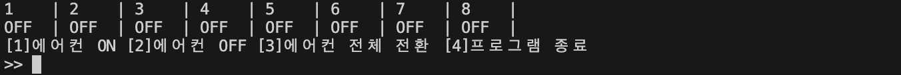
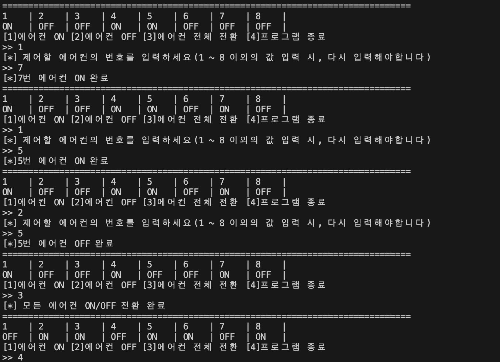
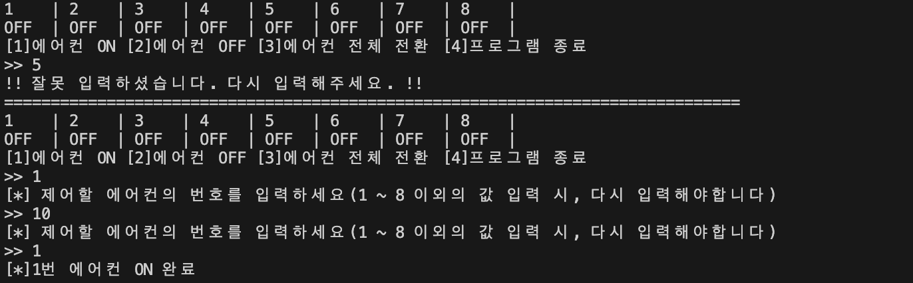

# 에어컨 관리 시스템

> 목표

- 총 8개의 에어컨 가동 관리 시스템 구현

 

> 세부 기능

1. 특정 에어컨만을 ON하는 기능 구현
2. 특정 에어컨만을 OFF하는 기능 구현
3. 전체 에어컨의 상태를 전환(반전)하는 기능 구현

 

> 참고 사항

- 처음 시작 상태는 모든 에어컨의 상태가 OFF라고 가정
- 입력 데이터는 숫자로 이루어진 데이터만 받는다고 가정
- 잘못 입력된 데이터에 대한 재입력 기회 제공

 

> 결과 화면

- 처음 시작 화면

- 세부 기능

- 잘못 입력된 데이터가 있을 때 화면

